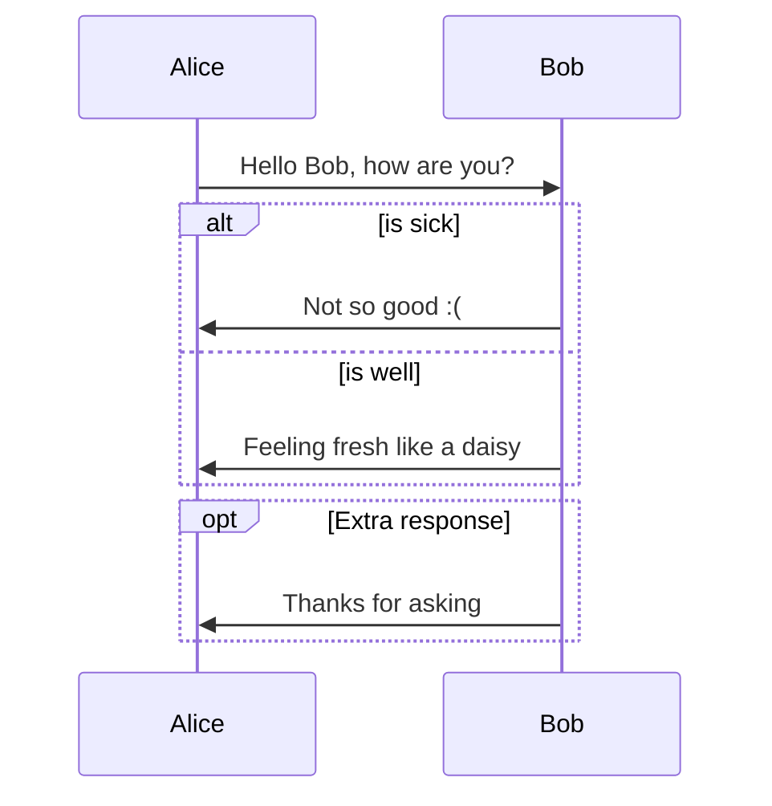

# 模拟电子技术的学习

~~~
https://www.eetree.cn/circuitjs/circuitjs.html
~~~

## 蓝桥云课

    https://www.lanqiao.cn/courses/2786
    https://www.lanqiao.cn/courses/2786/learning/?id=2871398&compatibility=false

## 第十四届蓝桥杯EDA赛模拟题一 - 嘉立创EDA开源硬件平台

    https://oshwhub.com/course-examples/di-shi-si-jie-lan-qiao-bei-eda-sai-mo-ni-ti-yi

## 立创开发板技术文档中心

    https://wiki.lckfb.com/zh-hans/

## 书籍推荐

    Ti大学计划运放选型、原理、设计等基础知识手册
    电子学（Paul Horowitz）
    信号完整性分析（SI）、电磁兼容性分析（EMC）、电源完整性分析（PI）。 只讲可制造性分析（DFM) 

## 网站
    
   [21iC](https://www.21ic.com/)

[TI培训](https://edu.21ic.com/)

[硬汉嵌入式](https://www.armbbs.cn/forum.php?gid=24)

## 软件

    ADS、ltspice

## Markdown

[表格制作](https://tableconvert.com/)

[折叠语法](https://www.cnblogs.com/shirui/p/10763515.html) 

  
折叠文本

  此处可书写文本
  嗯，是可以书写文本的

  
折叠代码块

  <pre><code> 
     System.out.println("虽然可以折叠代码块");
     System.out.println("但是代码无法高亮");
  </code></pre>

[作图](https://www.cnblogs.com/shirui/p/10763443.html)

## STM32

[野火](zhttps://doc.embedfire.com/mcu/stm32/f103mini/std/zh/latest/book/First_acquaintance.html#id1)

    STM32F103XXX中文参考手册

## ROS

    http://www.autolabor.com.cn/book/ROSTutorials/

## 学习

    存放做过的项目